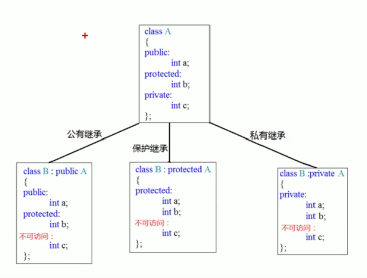
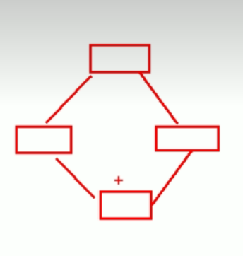
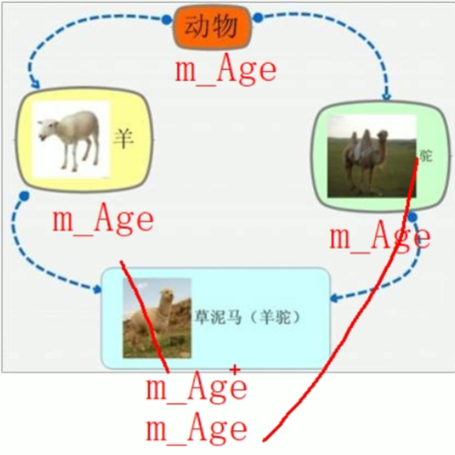

[TOC]

# C++ 面向对象特性

主要包含C++面向对象特性的学习

# 一、C++中的引用

引用就是给变量起一个**别名**，底层通常通过指针实现，但编译器会优化为直接操作所引用的对象。

```C++
int a = 10;
int &b = a;
b = 100;
cout << "a = " << a << endl;
cout << "b = " << b << endl;//a和b的值都为100
```

* 不存在空引用，引用必须连接到一块合法的内存。
* 一旦引用被初始化为一个对象，就不能被指向到另一个对象。指针可以在任何时候指向到另一个对象。
* 引用必须在创建时初始化。指针可以在任何时间被初始化。
* 引用的对象必须时一个变量，而指针必须是一个地址。


## 引用作为函数参数

函数的引用参数相当于传入函数参数的别名，可以对实际参数进行修改。

```cpp
#include <iostream>
using namespace std;

void swap_ref(int &a , int &b)
{
    int temp = a;
    a = b;
    b = temp;
}

int main()
{
    int a = 10;
    int &b = a;
    b = 100;
    cout << "a = " << a << endl;
    cout << "b = " << b << endl;//a和b的值都为100

    int x = 4;
    int y = 16;
    swap_ref(x,y);//函数的引用参数a,b相当于x,y的别名
    cout << "x = " << x << endl;
    cout << "y = " << y << endl;

    return 0;
}
```


## 引用作为函数返回值

将函数返回值看作一个变量，把引用作为返回值就是对给函数返回值变量起一个别名。

* 注意作用域，不能返回局部变量，但是可以返回静态变量。
* 可以将函数作为左值。

```cpp
#include <iostream>
using namespace std;

double arr[4] = {1.1,2.2,3.3,4.4};

void swap_ref(int &a , int &b)
{
    int temp = a;
    a = b;
    b = temp;
}

int& set_val(int a)
{
    //int val = a; //错误写法
    static int val = a;
    return val;
}

double& change_val(int i)//返回arr数组中第i个元素的引用
{
    return arr[i];
}


int main()
{
    int a = 10;
    int &b = a;
    b = 100;
    cout << "a = " << a << endl;
    cout << "b = " << b << endl;//a和b的值都为100


    int x = 4;
    int y = 16;
    swap_ref(x,y);
    cout << "x = " << x << endl;
    cout << "y = " << y << endl;


    cout << "before arr[3] = " << arr[3] << endl;
    change_val(3) = 10;//函数返回第4个元素的引用，等号为这个引用对象赋值
    cout << "after arr[3] = " << arr[3] << endl;
 
    int& val = set_val(36);//函数第一次调用初始化静态变量并返回静态变量val的引用
    cout << "0-val = " << val << endl;
    set_val(0);//函数第二次调用不会重复初始化静态变量
    cout << "1-val = " << val << endl;
    set_val(0) = 50;//利用引用实现函数作为左值，修改静态变量值
    cout << "2-val = " << val << endl;
    return 0;
}
```

## 引用本质

在C++内部通过指针常量实现，指针常量指向不可改，所以引用也不能更改对象

```cpp
int a = 10;
int &ref = a;
int* const ref_ = a;//变量类型是int* ，指针本身是常量，指向不可变；对比const int* 指向内容是常量，内容不能改变；对比常量指针常量const int* const，指向和对应内容都不变 
```

## 常量引用

初始化常量引用时允许用任意表达式作为初始值，常量引用只能检测它引用的对象的类型，只要符合

1. 普通对象int等（等价转换为两行）
2. 字面量或表达式

```cpp
int i = 42;  
const int &r1 = i;       //正确：允许将const int & 绑定到一个普通int对象上  
const int &r2 = 42;      //正确  
const int &r3 = r1 * 2;  //正确  
int &r4 = r1 * 2;        //错误  
  
double dval = 3.14;  
const int &ri = dval;    //正确  
//等价于  
const int temp = dval;  
const int &ri = temp;  
  
int i = 42;  
int &r1 = i;  
const int &r2 = i;  
r1 = 0;                  //正确  
r2 = 0;                  //错误
```

## 关于为什么要使用常量引用传递参数

在传递大型参数（比如某个对象类）时可以避免拷贝，节省空间。

```cpp
class Employee{
    public:
    	string name;
    	string position;
};

void printEmpDetails(Employee emp)
{
    cout << emp.name << endl;
    cout << emp.position << endl;
}
```

这种直接传递形参的方式会构造一个新的emp对象，既效率低下，也浪费存储空间。

下面是常量引用版：

```cpp
void printEmpDetails(const Employee &emp)
{
    cout << emp.name << endl;
    cout << emp.position << endl;
}
```

常量引用相当于const Employee* const emp ，传递的是一个指针，效率提升


# 二、函数重载

让函数名相同，提高复用性

1. 同一个作用域下（类内算一个作用域，类外也算一个作用域）
2. 函数名相同
3. 参数类型或个数或顺序不同，但返回值不能作为重载条件

```cpp
#include <iostream>
using namespace std;

void print(int dat)
{
    cout << "整数是" << dat << endl;
}

void print(float dat)
{
    cout << "浮点数是" << dat << endl;
}

void print(char *dat)
{
    cout << "字符串是" << dat << endl;
}

int main()
{
    char arr[11] = "1234567890";
    print(arr);

    int dat = 22;
    print(dat);
    return 0;
}
```

## 引用作为函数重载参数

参数是否为常量引用也能作为重载条件

```cpp
void func(int &a)
{
    cout << "func(int &a)" << endl;
}
void func(const int &a)
{
    cout << "func(const int &a)" << endl;
}

int main()
{
    int a = 10;
    func(a);//调用func(int &a)
    func(10);//调用func(const int &a)
    return 0;
}
```


## 函数重载中的默认参数

```cpp
void func(int a, int b=100)
{
    cout << "func(int a, int b=100)" << endl;
}
void func(int a)
{
    cout << "func(int a)" << endl;
}

int main()
{
    func(1);//这里会报错
    return 0;
}
```

函数重载中尽量不使用默认参数，如代码中所示重载让调用`func(1)`出现了二义性


# 三、封装

利用C++类，将属性和行为作为一个整体

## 访问权限

1. public：谁都能用。做接口API用
2. private：只有自己能用。存数据用（默认安全选项）。
3. protected：只有家族（继承链）能用。给子类留后门用。

**struct和class的唯一区别就是默认权限，struct默认是public而class是private**

**通常将对象属性设置为private，在public中提供读写接口函数**

## 构造函数和析构函数

说人话就是对象的初始化和清理

* 构造函数`class_name(){}`：主要作用在于创建对象时为成员赋初值，编译器在构件类时自动调用
  1. 没有返回值也不写void
  2. 函数名与类名相同
  3. 构造函数可以有参数，因此可以发生重载
  4. 创建对象时自动调用构造，且只调用一次

* 析构函数`~class_name(){}`：在对象销毁前执行的清理工作，也有编译器自动调用
  1. 没有返回值也不写void
  2. 函数名与类名相同，名称前加上 `~`
  3. 析构函数不能有参数，因此不能发生重载
  4. 对象销毁时自动调用析构，且只调用一次

## 拷贝构造函数

```cpp
class Person{
    public:
    //普通构造函数
        Person(){
			age = 0;
        }
    	Person(int age_i){
			age = age_i;
        }
    //拷贝构造函数
        Person(const Person &P){
			age = P.age;
        }
    	~Person(){
            cout << "destroy a Person class" << endl;
        }
    private:
    	int age;
};
```

调用时需要注意

```cpp
int main(){
    Person p1;//使用本行代码调用无参构造函数
    //Person p1();//这种写法不能创建对象的,编译器会将这行代码识别为函数的声明(返回值类型Person,函数名p1的函数声明)。
    Person p2(10);//调用有参构造函数
    Person p3(p2);//调用拷贝构造函数
    return 0;
}
```

显示法调用

```cpp
Person p4 = Person(2);
Person p5 = Person(p4);
```

隐式法调用

```cpp
Person p6 = 10;//隐式转换法调用构造函数 本行代码相当于 Person p6 = Person(10);
Person p7 = p6;//隐式转换法调用拷贝构造函数 本行代码相当于 Person p6 = Person(p6);
```

## 深拷贝与浅拷贝

* 浅拷贝：简单的赋值拷贝操作

  ```cpp
  #include <iostream>
  #include <string>
  using namespace std;
  
  class Person{
      public:
      //普通构造函数
          Person(){
              Height = new int(160);
  			age = 0;
          }
      	Person(int age_i,int H_i){
  			age = age_i;
              Height = new int(160);
          }
      //使用默认的拷贝构造函数
      	~Person(){
              if(Height != NULL){
                  delete Height;
                  Height = NULL;
              }
              cout << "destroy a Person class" << endl;
          }
          
  //   private:
      	int age;
          int *Height;
  };
  
  
  int main(){
      Person p1(22,160);//这里释放第二次，Error！
      cout << "age:" << p1.age << "\nheight:" << *p1.Height << endl;
  
      Person p2(p1);//这里释放第一次
      cout << "age:" << p2.age << "\nheight:" << *p2.Height << endl;
      return 0;
  }
  ```

  使用默认的拷贝构造函数会出现浅拷贝问题，可能导致堆区数据重复释放。

  在调用拷贝构造函数创建新的对象时，处理器将逐字节将源对象复制到新对象，当这个对象的属性中含有指针时也会拷贝这个指针（相当于两个指针指向同一块内存）。但程序结束时调用两次析构函数，也就对同一块内存释放了两次，从而产生错误。

  

* 深拷贝：在堆区重新申请空间，进行拷贝操作

  ```cpp
  //拷贝构造函数
      Person(const Person &P){
          age = P.age;
          Height = new int(*P.Height);
      }
  ```

  自行实现拷贝构造函数，在堆区为自己的属性指针分配一块内存即可

  ***若属性有在堆区开辟空间，一定要自己提供拷贝构造函数，防止出现浅拷贝问题！***

## 初始化列表

`Person(const Person &P):age(P.age), height(P.height), weight(P.weight)`

```cpp
#include <iostream>
using namespace std;

class Person{
    public:
    	Person(int a_i, int h_i, int w_i):age(a_i), height(h_i), weight(w_i){
            cout << "age:" << age << endl;
            cout << "height:" << height << endl;
            cout << "weight:" << weight << endl;
        };
    	Person(const Person &P):age(P.age), height(P.height), weight(P.weight){
            cout << "age:" << age << endl;
            cout << "height:" << height << endl;
            cout << "weight:" << weight << endl;
        };
    	int age;
    	int height;
    	int weight;
};

int main()
{
    Person p1(22,178,67);
    Person p2(p1);
    return 0;
}
```

## 类对象作为类成员

* 当其他类对象作为本类成员，构造的时候先构造其他类对象，再构造自身，析构顺序与构造相反。

## 类的静态成员

* #### 静态成员变量

1. 在编译阶段分配内存

2. 类内声明，类外初始化

3. 所有对象共享同一份数据


* #### 静态成员函数

1. 程序共享一个函数
2. 静态成员函数只能访问静态成员变量
3. 两种访问方式

```cpp
#include <iostream>
#include <string>
using namespace std;

class Person{
    public:
    	Person(int a_i, int h_i, int w_i):age(a_i), height(h_i), weight(w_i){
            person_num++;
            cout << "age:" << age << endl;
            cout << "height:" << height << endl;
            cout << "weight:" << weight << endl;
        };
    	Person(const Person &P):age(P.age), height(P.height), weight(P.weight){
            person_num++;
            cout << "age:" << age << endl;
            cout << "height:" << height << endl;
            cout << "weight:" << weight << endl;
        };
    	int age;
    	int height;
    	int weight;
        static int person_num;//类内声明

        static void print_num(){
            cout << person_num << endl;
        }
    
    private:
        static string pass_word;
};

//类外初始化
int Person::person_num = 0;
string Person::pass_word = "10086";

class Empyt_Class{
    
};
int main()
{
    Person p1(22,178,67);
    Person p2(p1);
    Person p3(p1);
    Person p4(p1);
    Person p5(p1);
    Person p6(p1);
    Person p7(p1);
    cout << "total person num:" << Person::person_num << endl;
    cout << "total person num:" << p1.person_num << endl;
    cout << "total person num:" << p7.person_num << endl;
    //Person::pass_word;//不可访问

    Person::print_num();
    p1.print_num();

    cout << "class size:" << sizeof(p1) << endl;//结果为3*4个字节 即是3个int 也就说明了成员变量和静态变量分开存储

    Empyt_Class class_test;
    cout << "empty class size:" << sizeof(class_test) << endl;//空对象的占用内存1个字节
    return 0;
}//输出的person_num都为7
```

* 只有**非静态**的**成员变量**才属于类；静态成员变量、静态/非静态成员函数都不属于类

* 空对象的占用内存1个字节

## this指针

this指针指向	被调用的成员函数	所属***对象***

* 形参和成员变量同名，可用this指针来区分

  ```cpp
  #include <iostream>
  using namespace std;
  
  class Person{
      public:
          Person(int age){
              //age = age;
              this->age = age;//解决重名冲突
          }
  
          int age;
  };
  
  int main()
  {
      Person p1(22);
      cout << "age of p1:" << p1.age << endl;
      return 0;
  }
  ```

* 在类的非静态成员函数中返回对象本身，可使用`return *this`

```cpp
#include <iostream>
using namespace std;

class Person{
    public:
        Person(int age){
            //age = age;
            this->age = age;//解决重名冲突
        }
        Person& PersonAddAge(const Person &p){
            this->age += p.age;
            return *this;//返回这个对象
        }
        Person* PersonAddAge_return_ptr(const Person &p){
            this->age += p.age;
            return this;//返回指向这个对象的指针
        }
        int age;
};

int main()
{
    Person p1(22);
    Person p2(16);
    cout << "age of p1:" << p1.age << endl;

    p1.PersonAddAge(p2).PersonAddAge(p2).PersonAddAge(p2);//链式编程 22+16+16+16
    cout << "after age of p1:" << p1.age << endl;

    p2.PersonAddAge_return_ptr(p1)->PersonAddAge_return_ptr(p1)->PersonAddAge_return_ptr(p1);
    cout << "after age of p2:" << p2.age << endl;
    return 0;
}
```

### 空指针访问成员函数

```cpp
#include <iostream>
using namespace std;

class Person{
    public:

        void print_class_name(){
            cout << "Person" << endl;
        }
        void print_age(){
            if(this == NULL){
                cout << "this ptr is NULL!" << endl;
                return;
            }      
            cout << "age:" << this->m_Age << endl;
        }
        int m_Age;
};

int main(){
    Person *ptr = NULL;
    ptr->print_class_name();//空指针能够访问这个函数
    ptr->print_age();//由于this是空指针，访问this指针时会出错，可添加判断条件来规避
    return 0;
}
```

## const 修饰成员函数

### 常函数

* 成员函数***后面***加const称为常函数
* 常函数内不能修改成员属性
* 成员属性声明时加关键字mutable后，在常函数中依然可以修改

```cpp
#include <iostream>
#include <string>
using namespace std;

class Person{
    public:
        Person(int age){
            //age = age;
            this->age = age;//解决重名冲突
            this->judge = "no judgement";
        }
        
        void showPerson() const{
            //this指针本身是一个指针常量 Person* const this
            //this->age = 100;//该函数传入的this指针是const Person* const this，即常量指针常量，不能更改指向和指向对象的值
            cout << "age:" << this->age << endl;
        }

        void showGoodJudge() const{
            this->judge = "he is a very nice people";
            cout << "Judge:" << this->judge << endl;
        }
        int age;
        mutable string judge;//加mutable的特殊变量，常函数中也能修改该值
};      

int main()
{
    Person p1(22);
    Person p2(16);
    p1.showPerson();
    p1.showGoodJudge();
    return 0;
}
```

this指针本身是一个指针常量 Person* const this，this的指向不能修改

该函数传入的this指针是const Person* const this，即常量指针常量，不能更改指向和指向对象的值

加mutable的特殊变量，常函数中也能修改该值

### 常对象

* 声明对象前加const称该对象为常对象
* 常对象只能调用常函数

```cpp
#include <iostream>
#include <string>
using namespace std;

class Person{
    public:
        Person(int age){
            //age = age;
            this->age = age;//解决重名冲突
            this->judge = "no judgement";
        }
        
        void set_age(int age){
            this->age = age;
        }

        void showPerson() const{
            //this指针本身是一个指针常量 Person* const this
            //this->age = 100;//该函数传入的this指针是const Person* const this，即常量指针常量，不能更改指向和指向对象的值
            cout << "age:" << this->age << endl;
        }

        void showGoodJudge() const{
            this->judge = "he is a very nice people";
            cout << "Judge:" << this->judge << endl;
        }
        int age;
        mutable string judge;//加mutable的特殊变量，常函数中也能修改该值
};      

int main()
{
    Person p1(22);
    const Person p2(16);
    p1.showPerson();
    p1.showGoodJudge();

    p2.judge = "he is not so good";
    cout << "judgement of p2:" << p2.judge << endl;

    //p2.set_age(100);//常对象只能调用常函数，若调用非常函数则有可能更改属性，与常对象规则不符
    return 0;
}
```

常对象只能调用常函数，若调用非常函数则有可能更改属性，与常对象规则不符

## 友元

让类外的一些函数或者类访问私有属性

* 全局函数作友元

* 类作友元

* 成员函数作友元

```cpp
#include <iostream>
#include <string>
using namespace std;

class Building;

class BadGay{
    public:
        BadGay();
        void visit_building();
        void visit_building_with_gun();
    private:
        Building *b;
};

class Building{
    friend void visit_func_global(const Building &b);
    friend void BadGay::visit_building_with_gun();
    friend class GoodGay;
    public:
        Building(){
            this->m_SittingRoom = "101";
            this->m_BedRoom = "102";
        }
        Building(string num_SittingRoom, string num_BedRoom){
            this->m_SittingRoom = num_SittingRoom;
            this->m_BedRoom = num_BedRoom;
        }

        string m_SittingRoom;
    private:
        string m_BedRoom;
};


class GoodGay{
    public:
        GoodGay();
        void visit_building();
    private:
        Building *b;
};

GoodGay::GoodGay(){
    this->b = new Building("110","111");
}

void GoodGay::visit_building(){
    cout << "GoodGay visit SittingRoom Num:" << this->b->m_SittingRoom << endl;
    cout << "GoodGay visit BedRoom Num:" << this->b->m_BedRoom << endl;
}

BadGay::BadGay(){
    this->b = new Building("220","221");
}

void BadGay::visit_building(){
    cout << "BadGay visit SittingRoom Num:" << this->b->m_SittingRoom << endl;
    cout << "BadGay can not visit BedRoom" << endl;
}
void BadGay::visit_building_with_gun(){
    cout << "BadGay visit SittingRoom Num:" << this->b->m_SittingRoom << endl;
    cout << "BadGayWithGun visit BedRoom Num:" << this->b->m_BedRoom << endl;
}

void visit_func_global(const Building &b)
{
    cout << "Golbal visit SittingRoom Num:" << b.m_SittingRoom << endl;
    cout << "Golbal visit BedRoom Num:" << b.m_BedRoom << endl;
}


int main()
{
    Building b1;
    visit_func_global(b1);

    GoodGay gg;
    gg.visit_building();
    
    BadGay bg;
    bg.visit_building();
    bg.visit_building_with_gun();
    
    return 0;
}
```

注意一个声明顺序问题，若`BadGay`类的对象在`Building`类之后定义，那么声明成员函数作为友元函数时`friend void BadGay::visit_building_with_gun();`编译器不知道BadGay内部构造，不知道是否有这个函数存在


# 四、继承

`class 子类 : 继承方式 父类`

继承允许我们依据一个类来定义另一个类，减少重复代码

当创建一个类时，不需要重新编写新的数据成员和成员函数，只需指定新建的类继承一个已有的类的成员即可，已有的类称为**基类**，新建的类称为**派生类**

```cpp
#include <iostream>
#include <string>
using namespace std;

class Animal {
    public:
        void eat() {
            cout << "the animal is eating" << endl;
        }
        void sleep() {
            cout << "the animal is sleeping" << endl;
        }
};

class Dog : public Animal {
    public:
        void bark(){
            cout << "the dog is barking" << endl;
        }
};

class Cat : public Animal {
    public:
        void jump(){
            cout << "the cat is jumping" << endl;
        }
};

int main(){
    Dog d1;
    d1.eat();
    d1.sleep();
    d1.bark();

    Cat c1;
    c1.eat();
    c1.sleep();
    c1.jump();
    return 0;
}
```

## 继承方式

父类中私有内容子类都无法访问。

* 公有继承：当一个类派生自**公有**基类时，基类的**公有**成员也是派生类的**公有**成员，基类的**保护**成员也是派生类的**保护**成员，基类的**私有**成员不能直接被派生类访问，但是可以通过调用基类的**公有**和**保护**成员来访问。

* 保护继承：当一个类派生自**保护**基类时，基类的**公有**和**保护**成员将成为派生类的**保护**成员。

* 私有继承：当一个类派生自**私有**基类时，基类的**公有**和**保护**成员将成为派生类的**私有**成员。



* 继承中构造和析构顺序：现有父亲后有儿子；析构顺序和构造相反

```cpp
#include <iostream>
using namespace std;

class Son : public Base {
    public:
        Son(){
            cout << "Son constructor called" << endl;
        }
        ~Son(){
            cout << "Son destructor called" << endl;
        }

};

void test_base_son(){
    Son s1;
}
int main(){
    test_base_son();
    return 0;
}
```

* 同名成员访问需要加作用域

```cpp
#include <iostream>
using namespace std;

class Base{
    public:
    	Base(){
            this->m_Num = 10;
        }
    	Base(int num){
            this->m_Num = num;
        }
    	int m_Num;
        static int m_SNum;
};
int Base::m_SNum = 100;

class Son : public Base{
    public:
    	Son(){
            this->m_Num = 1000;
        }
    	Son(int num){
            this->m_Num = num;
        }
    	int m_Num;
        static int m_SNum;
};
int Son::m_SNum = 200;

int main(){
    Son s1;
    cout << "Son num:" << s1.m_Num << endl;
    cout << "Base num:" << s1.Base::m_Num << endl;
//通过对象访问静态成员
    cout << "Son static num:" << s1.m_SNum << endl;
    cout << "Base static num:" << s1.Base::m_SNum << endl;
//通过类名访问静态成员
    cout << "Son static num:" << Son::m_SNum << endl;
    cout << "Base static num:" << Base::m_SNum << endl;
    cout << "Base static num:" << Son::Base::m_SNum << endl;
	return 0;
}
```

## 多继承语法

一个类继承多个类：`class 类名 : 继承方式1 父类1, 继承方式2 父类2, ...`

可能出现重名，需要加作用域区分，不建议使用

### 菱形继承（钻石继承）



两个派生类继承同一个基类，又有另外一个类继承这两个派生类。



问题：

1. 羊和驼都继承了年龄属性，草泥马使用时会出现二义性
2. 草泥马继承了两个年龄属性，实际上这种动物只需要一个年龄属性就够了

解决方法：虚继承

```cpp
#include <iostream>
using namespace std;

class Animal{
    public:
        Animal(){
            this->m_Age = 0;
            cout << "Animal constructor called" << endl;
        }
        ~Animal(){
            cout << "Animal destructor called" << endl;
        }
        int m_Age;
};

class Sheep : virtual public Animal{
    public:
        Sheep(){
            this->m_Age = 10;
            cout << "Sheep constructor called" << endl;
        }
        ~Sheep(){           
            cout << "Sheep destructor called" << endl;
        }
};

class Camel : virtual public Animal{
    public:
        Camel(){
            this->m_Age = 20;
            cout << "Camel constructor called" << endl;
        }
        ~Camel(){
            cout << "Camel destructor called" << endl;
        }
};

class SheepCamel : public Sheep, public Camel{
    public:
        SheepCamel(){
            cout << "SheepCamel constructor called" << endl;
        }
        ~SheepCamel(){
            cout << "SheepCamel destructor called" << endl;
        }
};
class CamelSheep : public Camel, public Sheep{
    public:
        CamelSheep(){
            cout << "CamelSheep constructor called" << endl;
        }
        ~CamelSheep(){
            cout << "CamelSheep destructor called" << endl;
        }
};


int main(){
    Sheep s1;
    Camel c1;
    SheepCamel sc1;
    CamelSheep cs1;
    cout << "Animal age:" << s1.Animal::m_Age << endl;
    cout << "Animal age:" << c1.Animal::m_Age << endl;

    cout << "Animal age:" << sc1.m_Age << endl;

    cout << "Animal age:" << cs1.m_Age << endl;
    return 0;
}
```

* 构造顺序是代码中的继承顺序
* 与普通继承不同，虚继承中派生类对象并不是在其内存中保留一份虚基类数据的副本，而是通过一种间接的引用方式，即将虚基类子对象的数据单独存放，在派生类对象中设置一个指针指向基类子对象。这样，当一个派生类通过多个继承路径继承同一个虚基类时，并不需要产生多个数据副本，而只要维护这个虚基类指针即可。


# 五、多态

当类之间存在层次结构，并且类之间是通过继承关联时，就会用到多态。

C++ 多态允许使用基类指针或引用来调用子类的重写方法，从而使得同一接口可以表现不同的行为。

```cpp
#include <iostream>
#include <string>
using namespace std;


class AbstractCal{
    public:
        virtual double getResult(){
            return 0;
        }
        double num1;
        double num2;
};

class AddCal : public AbstractCal{
    public:
        double getResult() override{
            return num1 + num2;
        }
};

class SubCal : public AbstractCal{
    public:
        double getResult() override {
            return num1 - num2;
        }
};

class Multical : public AbstractCal{
    public:
        double getResult() override {
            return num1 * num2;
        }
};

int main(){
    AbstractCal *Cal = new Multical;
    Cal->num1 = 10.0;
    Cal->num2 = 3.14;
    cout << Cal->num1 << " * " << Cal->num2 << " = " << Cal->getResult() << endl;
    delete Cal;

    Cal = new AddCal;
    Cal->num1 = 10.0;
    Cal->num2 = 3.14;
    cout << Cal->num1 << " + " << Cal->num2 << " = " << Cal->getResult() << endl;
    delete Cal;

    return 0;
}
```

虚函数签名不匹配的错误通常是因为 **函数名、参数列表 或 const 属性**不一样，导致意外创建了一个新的虚函数，而不是重写一个已存在的虚函数。

针对上述情况，C++ 11 增加了两个继承控制关键字：`override `和` final`，两者的作用分别为：

- `override`：保证在派生类中声明的重载函数，与基类的虚函数有相同的签名
- `final`：阻止类的进一步派生 和 虚函数的进一步重写

## 虚函数

定义他为**虚函数**是为了允许用基类的指针来调用子类的这个函数

虚函数通过虚函数指针（vfptr）和虚函数表（vftable）实现

## 纯虚函数

`virtual 返回值类型 函数名 (参数列表) = 0;`

在多态中，通常纯虚函数的实现是毫无意义的，主要都是调用子类重写的内容。

定义**纯虚函数**是为了实现一个接口，起到一个规范的作用，规范继承这个类的程序员必须实现这个函数。

### 抽象类

当类中有了纯虚函数，这个类也称为抽象类

1. 抽象类无法实例化
2. 子类必须重写抽象类中的纯虚函数，否则也属于抽象类

```cpp
#include <iostream>
#include <string>
using namespace std;

class Base{
    public:
        virtual void func() = 0;
};

class SonVirtual : public Base{
    
};

class Son : public Base{
    public:
        virtual void func() override {
            cout << "I am son of Base" << endl;
        };
};

int main(){
    Base &b = *new Son;
    b.func();

    Base *bptr = new Son;
    bptr->func();

    return 0;
}

```

一旦在基类中声明为虚函数，该函数在所有派生类中自动成为虚函数，无论是否使用 virtual 关键字

建议在重写时加上virtual关键字提高代码可读性

## 虚析构和纯虚析构

问题：子类在堆区有数据，需要调用子类析构函数释放内存，但多态中父类指针在释放时不会调用子类析构函数，导致内存泄露

虚析构和纯虚析构则可以实现父类指针释放子类对象，即delete父类指针时会先调用子类的析构再调用父类析构

```cpp
#include <iostream>
#include <string>
using namespace std;
class Animal{
    public:
        Animal(){
            AnimalNum++;
            cout << "Animal constructor called\t AnimalNum:" << this->AnimalNum <<endl;
        }        
        virtual ~Animal(){
            this->AnimalNum--;
            cout << "Animal destructor callded\t AnimalNum:" << this->AnimalNum << endl;
        }

        static int AnimalNum;
};
int Animal :: AnimalNum = 0;

class Cat : public Animal{
    public:
        Cat(string Name){
            this->Name = new string(Name);
            cout << "Cat constructor called" << endl;
        }         
        ~Cat() override {
            if(this->Name != NULL){
                delete this->Name;
                this->Name = NULL;
                cout << "Cat destructor called" << endl;
            }
        }

        string *Name;
};

class Dog : public Animal{
    public:
        Dog(string Name){
            this->Name = new string(Name);
            cout << "Dog constructor called" << endl;
        }         
        ~Dog() override {
            if(this->Name != NULL){
                delete this->Name;
                this->Name = NULL;
                cout << "Dog destructor called" << endl;
            }
        }

        string *Name;
};

int main(){
    Animal *a1 = new Cat("Tom");
    Animal *a2 = new Dog("Judy");
    delete(a1);
    delete(a2);
    return 0;
}
```

上述代码中子类析构函数不加virtual关键字会导致子类中的成员`string *Name`不被释放，导致内存泄漏

